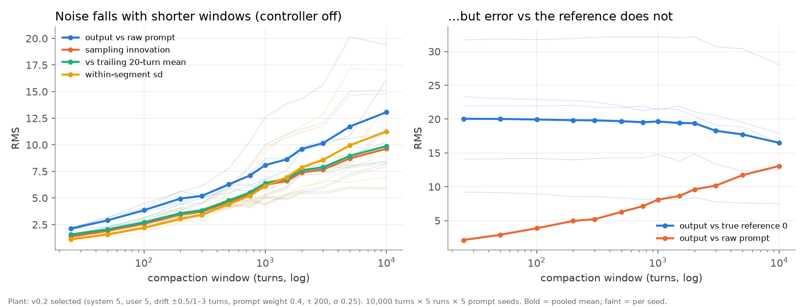

# Compaction window and long-term noise, controller disabled

Completed 2026-09-16. This freezes the previously unrecorded observation in
[compaction-study-design.md](../compaction-study-design.md) that more frequent
compaction lowers long-term output noise in the scalar model. It is a saved numerical
study of the context-mixture simulator, not an LLM measurement.

**Result: every noise measure falls monotonically in the pooled mean as the
compaction window shrinks, by roughly 6–10× from no compaction to a 25-turn window.
Error against the true reference does not fall; it rises slightly.**



## Setup

- Simulator: `agent-loop-dashboard/cg/ml-context-mixture-simulation-javascript` 1.2.0,
  `simulate(options, noop, null, null, schedule)` with the controller disabled and an
  explicit periodic compaction schedule. No simulator code was changed.
- Plant: the [v0.2 selected configuration](../../../agent-loop-dashboard/public/research/v0.2/selected-configuration.json):
  `system 5, user 5, variation 0.5, promptWeight 0.4, tau 200, sigma 0.25, bump 0.25,
  similarityWidth 1, historyOutputWeight 1`. True reference 0; the raw prompt is the
  seeded human-error random walk.
- Horizon: 10,000 turns, 5 response runs per prompt seed, prompt seeds 104–108.
  Runs within a seed share the prompt path and draw independent plant and summary
  innovations. All 5 × 5 × 13 = 325 trajectories are retained in `results.json`.
- Windows: 25, 50, 100, 200, 300, 500, 750, 1000, 1500, 2000, 3000, 5000 turns, and
  no compaction. The schedule is `[w−1, 2w−1, …]`; the final partial segment is kept.

## Metrics

All are per-trajectory RMS over the full 10,000 turns, averaged across the five runs,
then across the five seeds. Nothing is smoothed before measuring.

| Metric | Definition |
|---|---|
| `rms_ref` | output − true reference (0) |
| `rms_prompt` | output − raw prompt at the same turn |
| `rms_mean_prompt` | plant conditional mean − raw prompt (history bias, no sampling) |
| `rms_innov` | output − plant conditional mean (pure sampling innovation) |
| `rms_step` | output[k] − output[k−1] |
| `rms_local` | output − causal trailing 20-turn mean |
| `seg_noise` | within-compaction-segment standard deviation, averaged over segments |

## Pooled results

| window | compactions | rms_ref | rms_prompt | rms_mean_prompt | rms_innov | rms_step | rms_local | seg_noise |
|---:|---:|---:|---:|---:|---:|---:|---:|---:|
| 25 | 399 | 20.05 | 2.12 | 1.62 | 1.38 | 1.95 | 1.57 | 1.12 |
| 50 | 199 | 20.03 | 2.89 | 2.19 | 1.90 | 2.68 | 2.05 | 1.56 |
| 100 | 99 | 19.93 | 3.85 | 2.86 | 2.58 | 3.64 | 2.71 | 2.20 |
| 200 | 49 | 19.84 | 4.94 | 3.56 | 3.44 | 4.86 | 3.57 | 3.02 |
| 300 | 33 | 19.81 | 5.19 | 3.65 | 3.72 | 5.23 | 3.85 | 3.43 |
| 500 | 19 | 19.69 | 6.28 | 4.27 | 4.62 | 6.51 | 4.77 | 4.41 |
| 750 | 13 | 19.53 | 7.12 | 4.69 | 5.37 | 7.58 | 5.53 | 5.21 |
| 1000 | 9 | 19.65 | 8.09 | 5.18 | 6.21 | 8.75 | 6.39 | 6.12 |
| 1500 | 6 | 19.42 | 8.63 | 5.52 | 6.60 | 9.31 | 6.79 | 6.94 |
| 2000 | 4 | 19.39 | 9.61 | 6.12 | 7.40 | 10.44 | 7.60 | 7.88 |
| 3000 | 3 | 18.27 | 10.16 | 6.64 | 7.68 | 10.85 | 7.89 | 8.59 |
| 5000 | 1 | 17.73 | 11.72 | 7.80 | 8.72 | 12.33 | 8.96 | 9.95 |
| none | 0 | 16.49 | 13.07 | 8.81 | 9.63 | 13.60 | 9.88 | 11.25 |

Per-seed monotonicity is not perfect: counting adjacent-window reversals across the
13 windows, `rms_prompt` has 0, 1, 2, 1, 2 reversals for seeds 104–108, `rms_innov`
0, 2, 2, 0, 4, and `seg_noise` 0, 0, 1, 1, 1. Every reversal is a small local one
against a 6–10× overall trend. No interior minimum appears; the noise floor is still
falling at the shortest window tested. Per-seed and per-run values are in `results.json`.

## Interpretation

**Mechanism.** The innovation term — output about the plant's own conditional mean —
falls as much as every other measure. That is sampling noise, and in this plant its
spread is set by the population variance of the retained history. A long window holds
outputs from across a wide stretch of prompt drift, so the population is wide and every
sample is wide; compaction collapses it. The precise statement is therefore: *noise
scales with how much prompt drift the retained history spans*, not "compaction reduces
noise" in general. Under a fixed prompt, the same plant would show a much smaller
window effect. This is a model prediction, not a measured LLM property.

**Noise and error are separate levers.** `rms_ref` stays near 20 across the sweep and
rises slightly with more compaction, because output tracks the drifting prompt more
faithfully and the prompt is far from the reference. Compaction reduces variation
around whatever the agent is currently being asked; it does not bring the agent back
to the reference. Restoring the reference is the controller's job
([CONTROL-DESIGN](../CONTROL-DESIGN.md), [shared-reference](../../../agent-loop-dashboard/public/research/v0.3/shared-reference/README.md)).
This is consistent with the [early-compaction study](../../../agent-loop-dashboard/public/research/v0.3/early-compaction/README.md),
where earlier compaction sped adaptation but left RMSE essentially unchanged.

**Limits.** A simulator turn is not a calibrated agent turn or token count. The
summary in this plant is a sampled scalar with no lossiness cost; real handoffs lose
content (the early-compaction summary captured ~49% of a reference shift), which this
sweep does not charge for. The 60–90K operating range in
[bounded-context-working-set.md](../bounded-context-working-set.md) is a judgment
informed by this direction, not a value read off this curve. No gain, window or
harness threshold was changed by this study.

## Reproduce

From this directory:

```sh
node run.mjs 2>progress.log > table.tsv
MPLCONFIGDIR=/tmp/mpl ../../../.diagram-venv/bin/python plot.py
```

`run.mjs` writes `results.json` (the `ms` timing field varies between runs; all other
fields are deterministic and were confirmed identical across two independent
executions). `manifest.json` records SHA-256 for the frozen inputs and outputs.
